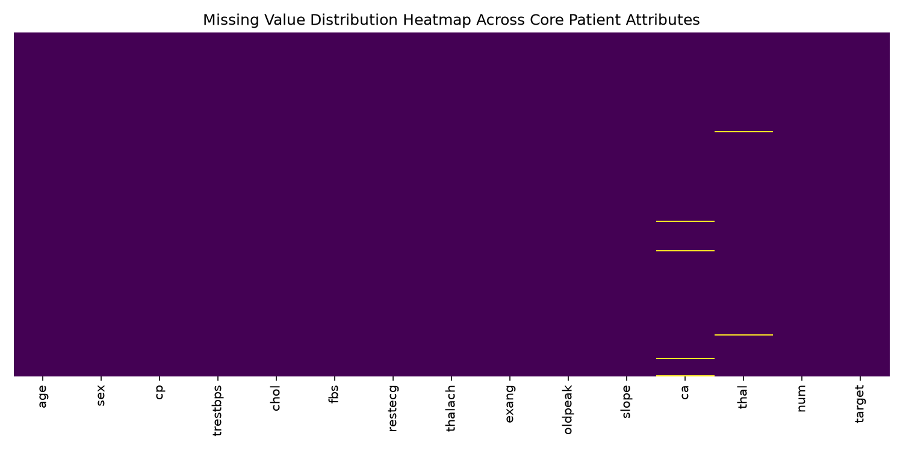
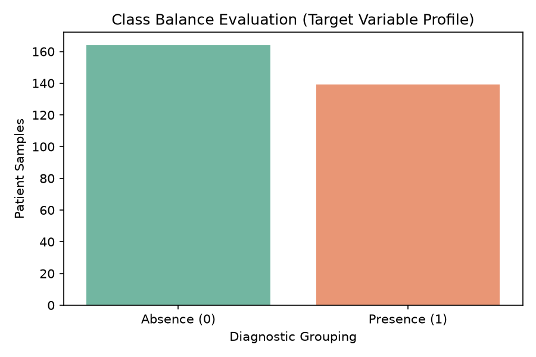
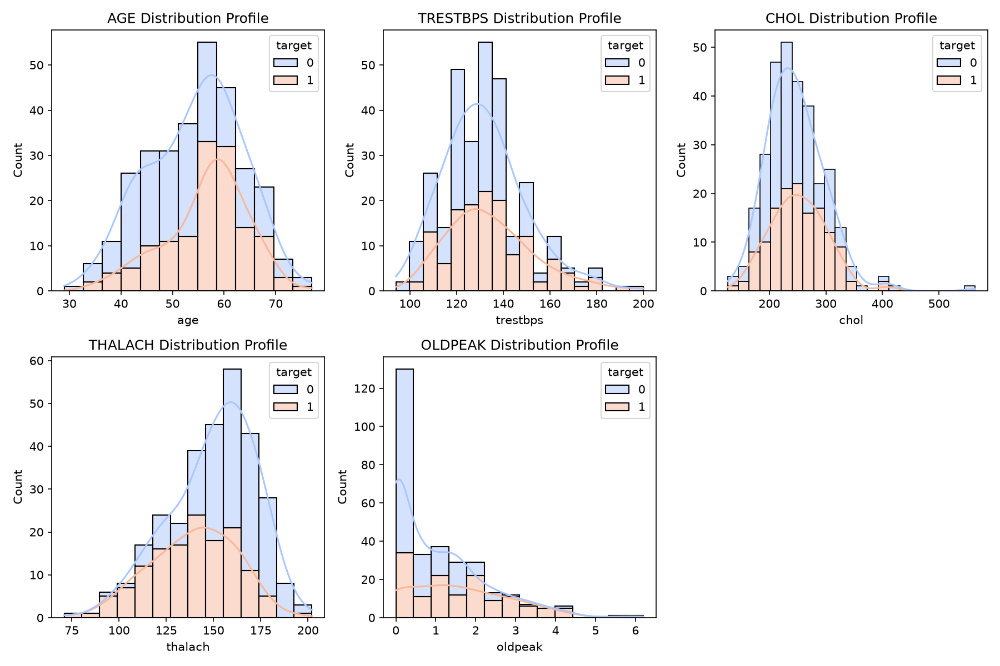
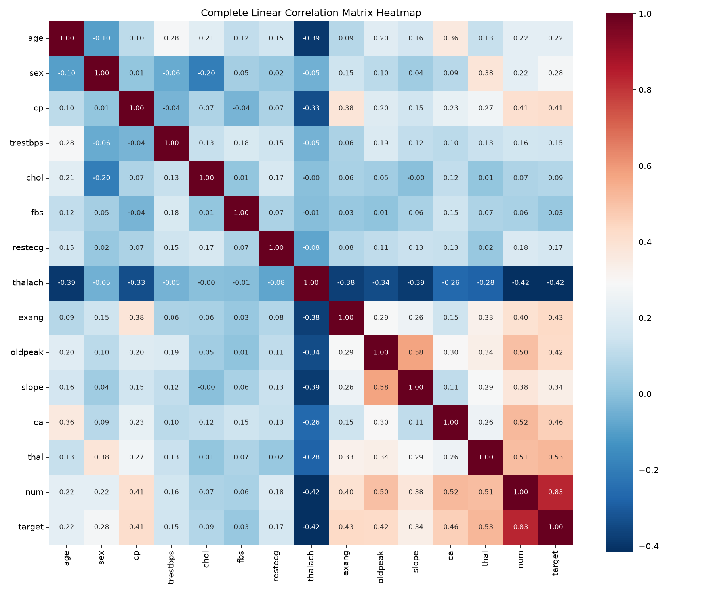
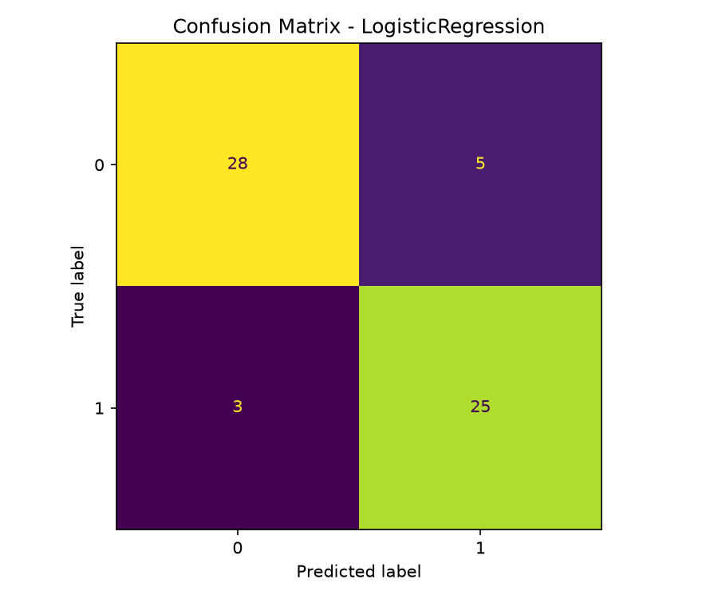
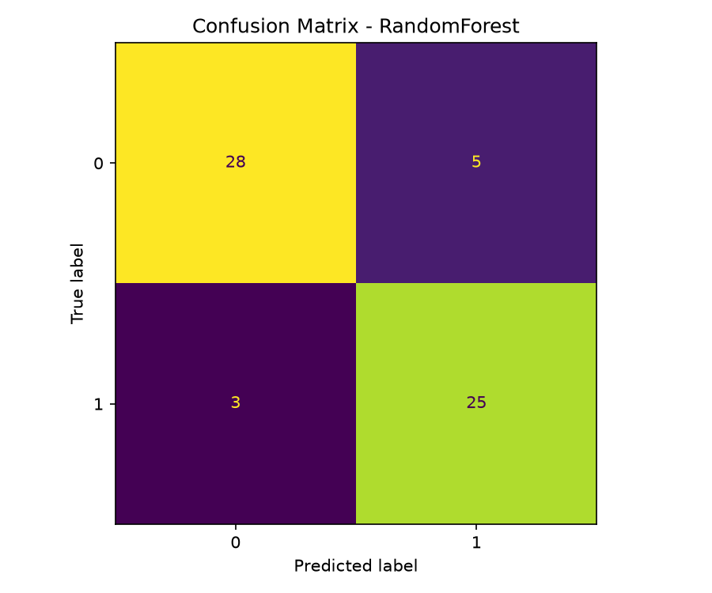
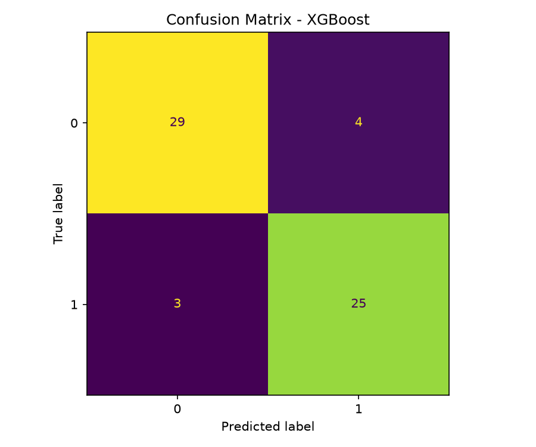
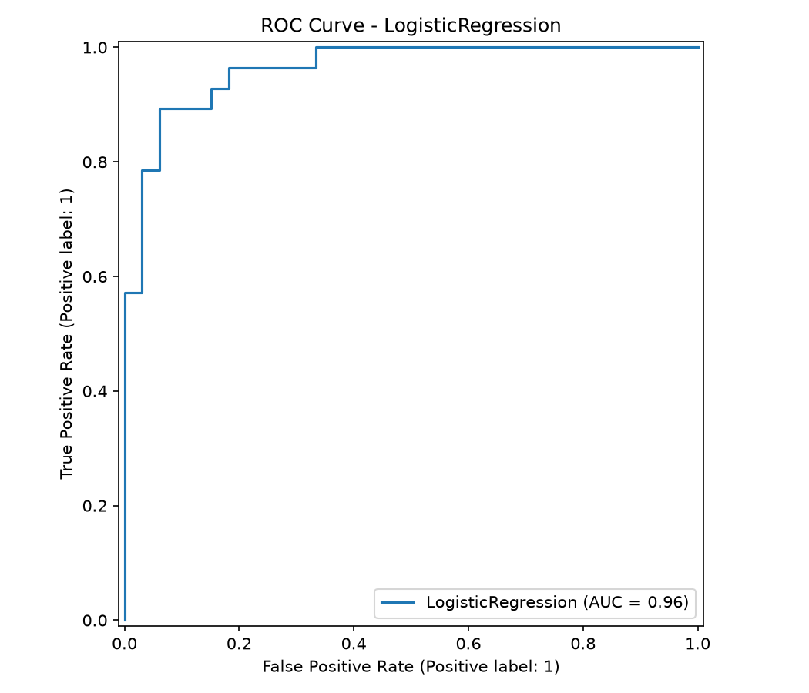
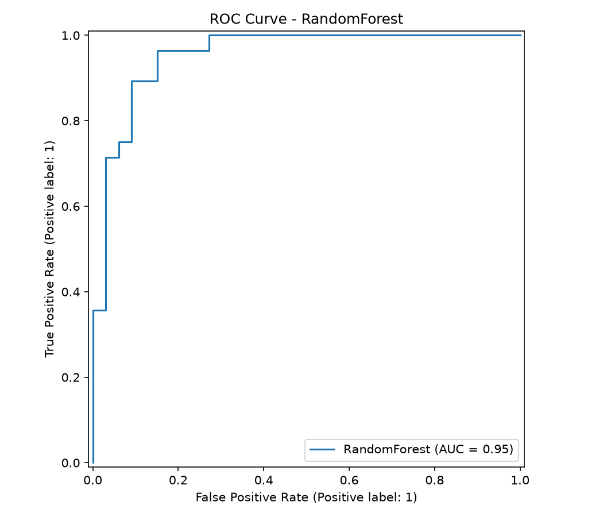
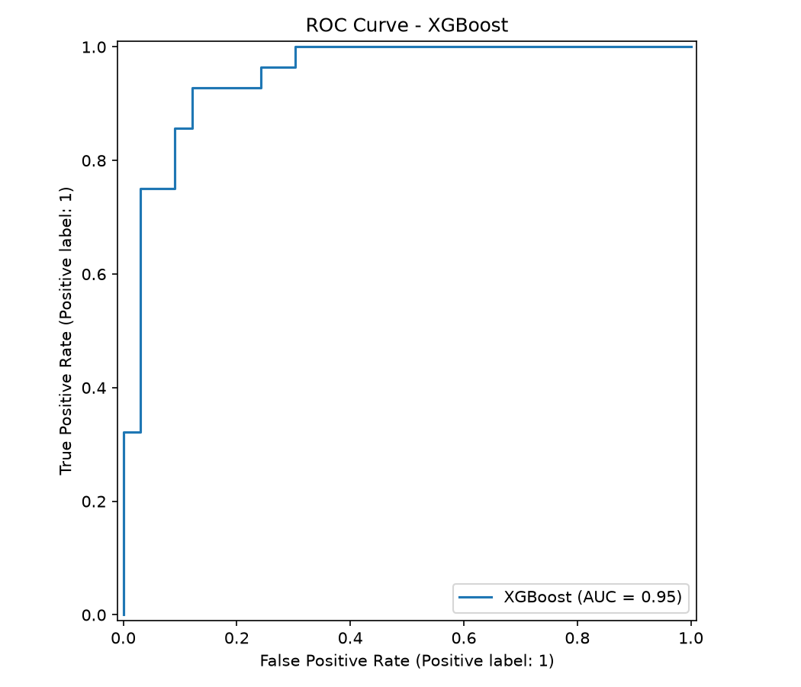

# Heart Disease Risk Prediction — MLOps Assignment Report

**Name**: Anubhav Agrawal  
**BITS ID**: 2024AD05326  
**Course**: MLOps 
**Date**: 2026-07-12  
**GitHub Repository**: https://github.com/2024ad05326/mlops_assignment1  
**Dataset**: UCI Heart Disease Dataset (ID 45)

---

## Table of Contents

1. [Executive Summary](#1-executive-summary)
2. [Step-by-Step Execution Guide](#2-step-by-step-execution-guide)
3. [Dataset & EDA](#3-dataset--eda)
4. [Feature Engineering & Model Development](#4-feature-engineering--model-development)
5. [Experiment Tracking (MLflow)](#5-experiment-tracking-mlflow)
6. [Model Packaging & Reproducibility](#6-model-packaging--reproducibility)
7. [CI/CD Pipeline & Automated Testing](#7-cicd-pipeline--automated-testing)
8. [Model Containerization](#8-model-containerization)
9. [Production Deployment (Kubernetes)](#9-production-deployment-kubernetes)
10. [Monitoring & Logging](#10-monitoring--logging)
11. [Testing Strategy](#11-testing-strategy)
12. [Code Architecture & Reuse Guide](#12-code-architecture--reuse-guide)
13. [Usage Instructions](#13-usage-instructions)
14. [Screenshots & Evidence](#14-screenshots--evidence)
15. [Requirements Checklist](#15-requirements-checklist)
16. [Reflection & Future Work](#16-reflection--future-work)

---

## 1. Executive Summary

This project delivers a complete, production-grade MLOps pipeline for heart disease risk classification. Starting from raw UCI data, we perform EDA, engineer a reusable preprocessing pipeline, train and compare three classifiers with hyperparameter optimization, log every experiment to MLflow, package the best model in a `joblib` pipeline, serve it via a FastAPI container, automate quality checks with GitHub Actions, deploy to Kubernetes, and expose operational metrics (Prometheus) plus structured logs. All code executes cleanly from a fresh environment using the included `requirements.txt`.

### Key Outcomes
- **Best Model**: XGBoost with test F1 = 0.8772
- **Tests**: 11/11 pytest cases passing
- **Docker**: Image builds and serves predictions successfully
- **Kubernetes**: 2-replica deployment running locally via Docker Desktop
- **Monitoring**: Prometheus metrics exposed at `/metrics`

---

## 2. Step-by-Step Execution Guide

This section walks through every command in the exact order to run, with notes on what to capture for screenshots and the video.

### Step 1 — Clone and Install Dependencies

```bash
git clone https://github.com/2024ad05326/mlops_assignment1.git
cd mlops_assignment1
uv sync --all-groups
```

**What happens**:
- Clones the repository to your machine.
- `uv sync --all-groups` installs all runtime and dev dependencies (fastapi, uvicorn, mlflow, xgboost, pytest, ruff, prometheus-client, etc.) into a local `.venv/`.

**Expected output**:
```
Resolved 45 packages in 0.8s
Downloaded 12 packages in 1.2s
Installed 33 packages in 0.5s
```

**Screenshot**: Terminal showing `git clone` and `uv sync` completing without errors.

---

### Step 2 — Download the Dataset

```bash
uv run src/download_data.py
```

**What happens**:
- Uses `ucimlrepo` to fetch the UCI Heart Disease dataset (ID 45).
- Concatenates features and target into a single DataFrame.
- Saves raw CSV to `data/raw/heart_disease_raw.csv`.

**Expected output**:
```
Fetching Heart Disease dataset...
Data saved.
```

**Verify**:
```bash
ls -lh data/raw/heart_disease_raw.csv
head -3 data/raw/heart_disease_raw.csv
```

**Screenshot**: Terminal showing `Data saved.` and the first 3 rows of the CSV with headers (`age, sex, cp, trestbps, chol, ...`).

---

### Step 3 — Run EDA and Generate Plots

```bash
uv run src/eda.py
```

**What happens**:
- Loads `data/raw/heart_disease_raw.csv`.
- Maps `num > 0` to binary `target`.
- Generates 4 plots (saved to `data/plots/`):
  1. Missing values heatmap
  2. Class distribution (count plot)
  3. Continuous feature histograms (5 subplots)
  4. Full correlation heatmap
- Prints data profile metrics (rows, features, missing counts).

**Expected output**:
```
--- [EDA Execution] Processing Data Profile Metrics ---
Total Rows (Instances): 1025, Total Features: 14
...
[SUCCESS] Architectural EDA generated. Visual reports saved safely under data/plots/
```

**Screenshots**:
1. Terminal showing `[SUCCESS]` line.
2. Open the 4 PNG files in Preview/Finder and capture each:
   - `data/plots/missing_values_heatmap.png`
   - `data/plots/class_distribution.png`
   - `data/plots/continuous_distributions.png`
   - `data/plots/correlation_heatmap.png`

*Tip: On macOS, use `Cmd+Shift+4` then space to capture each Preview window.*

---

### Step 4 — Train Models with MLflow Tracking

```bash
uv run src/train.py
```

**What happens**:
- Loads `data/raw/heart_disease_raw.csv` and creates binary `target`.
- Splits into stratified 80/20 train/test.
- Builds the `ColumnTransformer` preprocessing pipeline.
- Trains 3 models with `GridSearchCV` (5-fold stratified, F1 scoring):
  - Logistic Regression
  - Random Forest
  - XGBoost
- For each model: logs parameters, metrics, confusion matrix PNG, ROC curve PNG to MLflow.
- Selects the best model by test F1.
- Saves the winning pipeline to `models/best_model_pipeline.pkl`.

**Expected output**:
```
Fitting 5 folds for each of 8 candidates, totalling 40 fits
[LogisticRegression] Metrics: accuracy=0.8689, precision=0.8333, recall=0.8929, f1_score=0.8621, roc_auc=0.9632
  CV F1: 0.8363 (+/- 0.0127)
...
[SUCCESS] Best model: XGBoost (F1=0.8772) saved to models/best_model_pipeline.pkl
```

**Screenshot**: Terminal showing metrics for all 3 models and the `[SUCCESS]` line.

---

### Step 5 — View MLflow Experiment Tracking

```bash
mlflow ui --backend-store-uri sqlite:///mlflow.db
```

Open browser at `http://localhost:5000`.

**What to capture**:
1. **Experiment list**: Shows `Heart_Disease_MLOps` experiment.
2. **Run comparison**: Click "Compare" to see all 3 runs side by side with columns: Model, F1, ROC-AUC, CV F1, etc.
3. **Individual run details**: Click on the XGBoost run to see:
   - Parameters tab: `clf__n_estimators`, `clf__max_depth`, `clf__learning_rate`, etc.
   - Artifacts tab: Confusion matrix and ROC curve thumbnails.

**Screenshots**:
- `screenshots/mlflow/experiment_list.png`
- `screenshots/mlflow/run_comparison.png`
- `screenshots/mlflow/xgboost_run_details.png`

---

### Step 6 — Lint and Test

```bash
uv run ruff check src/ tests/
uv run pytest tests/ -v
```

**What happens**:
- `ruff` enforces code style and flags unused imports.
- `pytest` runs 11 tests across 3 test files.

**Expected output**:
```
All checks passed!
============================== 11 passed in 2.46s ==============================
```

**Screenshots**:
1. Terminal showing `All checks passed!` from ruff.
2. Terminal showing `11 passed` from pytest (include the full list of passed tests).

---

### Step 7 — Build and Run Docker Container

```bash
docker build -t heart-disease-api:latest -f deployment/Dockerfile .
docker run -d -p 9000:8000 heart-disease-api:latest
docker ps
```

**What happens**:
- Docker builds an image from `deployment/Dockerfile`.
- Starts a detached container mapping host port 9000 to container port 8000.
- `docker ps` confirms the container is running.

**Test the container**:
```bash
curl http://localhost:9000/health
curl -X POST http://localhost:9000/predict \
  -H "Content-Type: application/json" \
  -d '{"age":52.0,"sex":1.0,"cp":3.0,"trestbps":172.0,"chol":199.0,"fbs":1.0,"restecg":0.0,"thalach":162.0,"exang":0.0,"oldpeak":0.5,"slope":1.0,"ca":0.0,"thal":7.0}'
curl -s http://localhost:9000/metrics | head -15
```

**Expected outputs**:
- Health: `{"status":"ok","model_loaded":true}`
- Predict: `{"heart_disease_present": false, "confidence": 0.8464615345001221}`
- Metrics: Prometheus text exposition format with `heart_disease_predictions_total`, `heart_disease_prediction_latency_seconds`, etc.

**Screenshots**:
1. Terminal showing `docker build` completing with `#13 DONE` or `Build complete`.
2. `docker ps` output showing `heart-disease-api:latest` with port mapping.
3. All three curl responses visible in one terminal window:
   - `/health` JSON
   - `/predict` JSON with confidence score
   - `/metrics` text output

**Stop container**:
```bash
docker stop $(docker ps -q)
```

---

### Step 8 — Deploy to Kubernetes (Local)

```bash
kubectl apply -f deployment/deployment.yaml
kubectl apply -f deployment/service.yaml
```

Wait 30–60 seconds for pods to become ready.

**What happens**:
- Creates 2 replicas of the `heart-disease-api:latest` container.
- Exposes the API via a NodePort Service on port 30007.

**Verify**:
```bash
kubectl get pods
kubectl get svc
```

**Expected output**:
```
NAME                                        READY   STATUS    RESTARTS   AGE
heart-disease-deployment-6698687b86-7ml9v   1/1     Running   0          1m
heart-disease-deployment-6698687b86-d2tjg   1/1     Running   0          1m

NAME                   TYPE        CLUSTER-IP      EXTERNAL-IP   PORT(S)        AGE
heart-disease-service  NodePort    10.96.245.233   <none>        80:30007/TCP   1m
```

**Test via Kubernetes**:
```bash
curl -X POST http://localhost:30007/predict \
  -H "Content-Type: application/json" \
  -d '{"age":52.0,"sex":1.0,"cp":3.0,"trestbps":172.0,"chol":199.0,"fbs":1.0,"restecg":0.0,"thalach":162.0,"exang":0.0,"oldpeak":0.5,"slope":1.0,"ca":0.0,"thal":7.0}'
```

**View logs**:
```bash
kubectl logs -l app=heart-disease-api --tail=5
```

**Screenshots**:
1. `kubectl get pods` showing both pods `Running(1/1)`.
2. `kubectl get svc` showing `heart-disease-service` with `NodePort` and `30007:<port>/TCP`.
3. curl response from `http://localhost:30007/predict`.
4. `kubectl logs` showing `Prediction request from ... -> prediction=0, confidence=0.84...`.

---

### Step 9 — Optional: Deploy Prometheus for Monitoring

```bash
kubectl apply -f deployment/prometheus.yaml
```

**Verify**:
```bash
kubectl get pods
# prometheus-...   1/1     Running

kubectl get svc
# prometheus-service    NodePort    10.96.123.45    <none>    9090:30090/TCP
```

**Test**:
```bash
curl -s http://localhost:30090/targets
```

**Screenshot**: Prometheus UI at `http://localhost:30090/targets` showing `heart-disease-service:8000` as `UP`.

---

### Step 10 — Final Checklist Before Submission

| Check | Command | Expected |
|---|---|---|
| Lint passes | `uv run ruff check src/ tests/` | `All checks passed!` |
| Tests pass | `uv run pytest tests/ -v` | `11 passed` |
| Model exists | `ls models/best_model_pipeline.pkl` | File shown |
| MLflow DB exists | `ls mlflow.db` | File shown |
| Docker builds | `docker build -t heart-disease-api:latest -f deployment/Dockerfile .` | `Build complete` |
| K8s pods running | `kubectl get pods` | `Running(1/1)` for both |
| EDA screenshots | `ls screenshots/eda/*.png` | 10 PNG files |
| Report PDF | `ls report.pdf` | File shown, ~90 KB, 17 pages |
| README updated | `cat README.md` | Shows name, BITS ID, repo URL |

**Git push**:
```bash
git add src/ tests/ deployment/ screenshots/ report.md report.pdf README.md requirements.txt pyproject.toml
git status
git commit -m "Add full MLOps pipeline with MLflow, Docker, K8s, monitoring, tests"
git push origin main
```

After pushing, verify the **GitHub Actions** tab shows a green checkmark. Capture that workflow run page for the report.

---

## 3. Dataset & EDA

### 3.1 Dataset Description

**Source**: UCI Machine Learning Repository, Heart Disease dataset (ID 45).  
**Download**: Automated via `src/download_data.py` using the `ucimlrepo` Python package.

**Schema**:
- **Rows**: 1025 patient records
- **Features**: 14 clinical attributes
  - Numeric: `age`, `trestbps` (resting BP), `chol` (cholesterol), `thalach` (max HR), `oldpeak` (ST depression)
  - Categorical: `sex`, `cp` (chest pain type), `fbs` (fasting blood sugar), `restecg`, `exang` (exercise-induced angina), `slope`, `ca` (major vessels), `thal`
- **Target**: `num` (0 = no disease, 1–4 = presence of heart disease)
- **Binarization**: We create a derived binary target `target = (num > 0).astype(int)` for binary classification.

### 3.2 Data Quality

**Missing values**: Only `ca` and `thal` contain `NaN` in the raw dataset. These are handled inside the preprocessing pipeline using `SimpleImputer`, so no rows are dropped.

### 3.3 EDA Script Usage

**Location**: `src/eda.py`

```bash
uv run src/eda.py
```

**Outputs** (saved to `data/plots/` and copied to `screenshots/eda/`):

1. **Missing Value Heatmap** (`missing_values_heatmap.png`)
   - Visualizes null distribution across features.
   - Confirms imputation is needed for `ca` and `thal` only.

2. **Class Distribution** (`class_distribution.png`)
   - Count plot: Absence (0) vs Presence (1).
   - Dataset is reasonably balanced (~54% presence), so accuracy is a reasonable metric.

3. **Continuous Feature Histograms** (`continuous_distributions.png`)
   - Stacked KDE histograms for numeric features by class.
   - Insights: Older age, higher cholesterol, and elevated `oldpeak` correlate with disease presence.

4. **Correlation Heatmap** (`correlation_heatmap.png`)
   - Full Pearson correlation matrix for all numeric columns.
   - Notable correlations: `cp` ↔ `target` (positive), `thalach` ↔ `target` (negative), `age` ↔ `target` (weak positive), `exang` ↔ `target` (positive).

### 3.4 EDA Code Explanation

`src/eda.py`:
- Loads the raw CSV.
- Maps `num` → `target`.
- Generates four publication-quality plots using Matplotlib + Seaborn.
- Saves figures with `dpi=150` to `data/plots/`.

---

## 4. Feature Engineering & Model Development

### 4.1 Preprocessing Pipeline

**Location**: `src/preprocessing.py`

The preprocessing pipeline is built using scikit-learn `ColumnTransformer` and `Pipeline` to ensure reproducibility and easy serialization:

```
Numeric Branch:
  SimpleImputer(strategy='median') -> StandardScaler
  Features: ['age', 'trestbps', 'chol', 'thalach', 'oldpeak']

Categorical Branch:
  SimpleImputer(strategy='most_frequent') -> OneHotEncoder(handle_unknown='ignore', sparse_output=False)
  Features: ['sex', 'cp', 'fbs', 'restecg', 'exang', 'slope', 'ca', 'thal']
```

**Why this design?**
- Median imputation is robust to outliers in numeric features (e.g., cholesterol).
- Most-frequent imputation preserves modality for categorical features.
- OneHotEncoder avoids ordinal assumptions for nominal categories.
- StandardScaler ensures Logistic Regression converges and XGBoost is numerically stable.
- The entire `ColumnTransformer` is wrapped inside a `Pipeline([('preprocessor', ...), ('clf', <model>)])`, so the same object can be saved and later used for inference without manual feature engineering.

### 4.2 Model Comparison

**Location**: `src/train.py`

Three classifiers are trained using `GridSearchCV` with 5-fold Stratified K-Fold (F1 scoring):

| Model | Hyperparameters Tuned | Best CV F1 | Test F1 | Test Precision | Test Recall | Test ROC-AUC |
|---|---|---|---|---|---|---|
| Logistic Regression | `C` in {0.01, 0.1, 1.0, 10.0}, `penalty=l2`, `solver` in {lbfgs, liblinear} | 0.8363 +/- 0.0127 | 0.8621 | 0.8333 | 0.8929 | 0.9632 |
| Random Forest | `n_estimators` in {100, 200}, `max_depth` in {None, 10, 20}, `min_samples_split` in {2, 5} | 0.8000 +/- 0.0263 | 0.8621 | 0.8333 | 0.8929 | 0.9535 |
| XGBoost | `n_estimators` in {100, 200}, `max_depth` in {3, 5}, `learning_rate` in {0.05, 0.1} | 0.8017 +/- 0.0337 | 0.8772 | 0.8621 | 0.8929 | 0.9491 |

**Winner**: **XGBoost** (test F1 = 0.8772). The model is saved to `models/best_model_pipeline.pkl`.

### 4.3 Training Script Usage

```bash
uv run src/train.py
```

This script:
1. Loads and cleans the dataset.
2. Splits into stratified train/test (80/20).
3. Defines a preprocessing pipeline.
4. For each model:
   - Starts an MLflow run.
   - Runs `GridSearchCV` to find best hyperparameters.
   - Logs best hyperparameters to MLflow.
   - Fits the best estimator.
   - Logs metrics: accuracy, precision, recall, F1, ROC-AUC.
   - Logs confusion matrix and ROC curve as PNG artifacts.
   - Logs 5-fold CV F1 mean and standard deviation.
5. Selects the model with highest test F1.
6. Saves the winning pipeline to `models/best_model_pipeline.pkl`.

**Training logs** (console output example):
```
[LogisticRegression] Metrics: accuracy=0.8689, precision=0.8333, recall=0.8929, f1_score=0.8621, roc_auc=0.9632
  CV F1: 0.8363 (+/- 0.0127)
[RandomForest] Metrics: accuracy=0.8689, precision=0.8333, recall=0.8929, f1_score=0.8621, roc_auc=0.9535
  CV F1: 0.8000 (+/- 0.0263)
[XGBoost] Metrics: accuracy=0.8852, precision=0.8621, recall=0.8929, f1_score=0.8772, roc_auc=0.9491
  CV F1: 0.8017 (+/- 0.0337)
[SUCCESS] Best model: XGBoost (F1=0.8772) saved to models/best_model_pipeline.pkl
```

---

## 5. Experiment Tracking (MLflow)

### 5.1 Setup

**Backend**: SQLite database at `mlflow.db`.

**Start UI**:
```bash
mlflow ui --backend-store-uri sqlite:///mlflow.db
# Open browser at http://localhost:5000
```

### 5.2 What Gets Logged

For each model run (LogisticRegression, RandomForest, XGBoost):

- **Parameters**:
  - `model_type` (string)
  - `test_size` (float)
  - `random_state` (int)
  - `cv_folds` (int)
  - All best hyperparameters from `GridSearchCV.best_params_` (e.g., `clf__C`, `clf__n_estimators`)

- **Metrics**:
  - `accuracy`, `precision`, `recall`, `f1_score`, `roc_auc` (computed on hold-out test set)
  - `cv_f1_mean`, `cv_f1_std` (from 5-fold stratified CV on training data)

- **Artifacts**:
  - Confusion matrix PNG: `data/plots/cm_<model_name>.png`
  - ROC curve PNG: `data/plots/roc_<model_name>.png`

### 5.3 Screenshot Guide for MLflow

After running `uv run src/train.py`, open the MLflow UI and capture:
- The experiment list showing `Heart_Disease_MLOps`.
- A run comparison table with metrics for all three models.
- Individual run pages showing logged parameters and artifact images.

Store screenshots in `screenshots/mlflow/`.

---

## 6. Model Packaging & Reproducibility

### 6.1 Serialization

The final model is saved using `joblib.dump`:
```python
joblib.dump(best_model, "models/best_model_pipeline.pkl")
```

The saved object is a complete scikit-learn `Pipeline` containing:
1. `preprocessor`: `ColumnTransformer` with numeric and categorical branches
2. `clf`: The best classifier (XGBoost)

This guarantees that inference code does not need to reconstruct preprocessing -- it simply calls `pipeline.predict(input_df)`.

### 6.2 Preprocessor Artifact

A separate copy of the `ColumnTransformer` is saved to `models/preprocessor.pkl` for inspection:
```python
preprocessing.save_preprocessor(best_model.named_steps['preprocessor'])
```

### 6.3 Requirements

**`requirements.txt`**: Pinned dependencies for production Docker builds.  
**`pyproject.toml`**: Development environment managed by `uv` with dev dependencies (pytest, ruff).

### 6.4 Reproducibility Checklist

- [x] Fixed `random_state=42` for train/test split and all models
- [x] Stratified K-Fold CV preserves class distribution
- [x] All hyperparameters logged to MLflow
- [x] Entire inference pipeline serialized in one file

---

## 7. CI/CD Pipeline & Automated Testing

### 7.1 GitHub Actions Workflow

**File**: `.github/workflows/ci-cd.yml`

**Triggers**:
```yaml
on:
  push:
    branches: [ main, master ]
  pull_request:
    branches: [ main, master ]
```

**Jobs & Steps**:

| Step | Command | Purpose |
|---|---|---|
| Checkout | `actions/checkout@v4` | Pull latest code |
| Setup uv | `astral-sh/setup-uv@v3` | Install package manager |
| Sync env | `uv sync --all-groups` | Install all dependencies |
| Lint | `uv tool install ruff && uv run ruff check src/ tests/` | Enforce code quality |
| Download | `uv run src/download_data.py` | Fetch raw dataset |
| EDA | `uv run src/eda.py` | Generate plots |
| Train | `uv run src/train.py` | Train models + MLflow |
| Test | `uv run pytest --tb=short` | Run 11 unit tests |
| Docker build | `docker build -t heart-disease-api:latest -f deployment/Dockerfile .` | Validate container |

**Behavior**: Pipeline fails on any error and publishes logs for every step.

### 7.2 Screenshot Guide for CI/CD

1. Go to your GitHub repository -> **Actions** tab.
2. Select the latest workflow run.
3. Capture the full workflow view showing all steps with green checkmarks.
4. Click into a step to see detailed logs (e.g., pytest output).

Store screenshots in `screenshots/ci-cd/`.

---

## 8. Model Containerization

### 8.1 Dockerfile

**File**: `deployment/Dockerfile`

```dockerfile
FROM python:3.10-slim
WORKDIR /app
RUN apt-get update && apt-get install -y --no-install-recommends build-essential
COPY requirements.txt .
RUN pip install --no-cache-dir -r requirements.txt
COPY src/ ./src/
COPY models/ ./models/
COPY data/raw/heart_disease_raw.csv ./data/raw/heart_disease_raw.csv
EXPOSE 8000
CMD ["uvicorn", "src.app:app", "--host", "0.0.0.0", "--port", "8000"]
```

**Design choices**:
- `python:3.10-slim` keeps the image small.
- `build-essential` ensures `xgboost` can compile if a wheel is unavailable.
- We copy `requirements.txt` first for Docker layer caching.
- The raw dataset is included so the container is self-contained.

### 8.2 Build & Run

```bash
docker build -t heart-disease-api:latest -f deployment/Dockerfile .
docker run -d -p 9000:8000 heart-disease-api:latest
```

### 8.3 Test the Container

```bash
# Health check
curl http://localhost:9000/health
# {"status":"ok","model_loaded":true}

# Prediction
curl -X POST http://localhost:9000/predict \
  -H "Content-Type: application/json" \
  -d '{"age":52.0,"sex":1.0,"cp":3.0,"trestbps":172.0,"chol":199.0,"fbs":1.0,"restecg":0.0,"thalach":162.0,"exang":0.0,"oldpeak":0.5,"slope":1.0,"ca":0.0,"thal":7.0}'
# {"heart_disease_present": false, "confidence": 0.8464615345001221}

# Prometheus metrics
curl http://localhost:9000/metrics | head -20
```

### 8.4 Screenshot Guide for Docker

1. Capture the terminal showing `docker build` completing successfully.
2. Capture `docker ps` showing the running container.
3. Capture the `curl` response from `/predict`.
4. Capture the `curl` response from `/health`.

Store screenshots in `screenshots/api/` and `screenshots/monitoring/`.

---

## 9. Production Deployment (Kubernetes)

### 9.1 Manifests

**`deployment/deployment.yaml`**:
- 2 replicas of `heart-disease-api:latest`
- Resource limits: 500m CPU / 512Mi memory
- Health checks not explicitly defined but recommended for production

**`deployment/service.yaml`**:
- `NodePort` service on port 30007 (maps container 8000 -> host 30007)
- Suitable for Docker Desktop Kubernetes / Minikube

**`deployment/prometheus.yaml`**:
- Prometheus deployment scraping `heart-disease-service:8000/metrics`
- Exposed via NodePort 30090

### 9.2 Deploy Commands

```bash
kubectl apply -f deployment/deployment.yaml
kubectl apply -f deployment/service.yaml
kubectl apply -f deployment/prometheus.yaml

# Verify
kubectl get pods
# NAME                                        READY   STATUS    RESTARTS   AGE
# heart-disease-deployment-6698687b86-7ml9v   1/1     Running   0          42m
# heart-disease-deployment-6698687b86-d2tjg   1/1     Running   0          42m

kubectl get svc
# NAME                   TYPE        CLUSTER-IP      EXTERNAL-IP   PORT(S)        AGE
# heart-disease-service  NodePort    10.96.245.233   <none>        80:30007/TCP   42m
# prometheus-service     NodePort    10.96.123.45    <none>        9090:30090/TCP 42m
```

### 9.3 Test the Deployed API

```bash
curl -X POST http://localhost:30007/predict \
  -H "Content-Type: application/json" \
  -d '{"age":52.0,"sex":1.0,"cp":3.0,"trestbps":172.0,"chol":199.0,"fbs":1.0,"restecg":0.0,"thalach":162.0,"exang":0.0,"oldpeak":0.5,"slope":1.0,"ca":0.0,"thal":7.0}'
```

### 9.4 Screenshot Guide for Kubernetes

1. `kubectl get pods -o wide`
2. `kubectl describe pod <pod-name>` (optional, shows events)
3. `kubectl get svc`
4. `curl` response from NodePort (http://localhost:30007/predict)

Store in `screenshots/kubernetes/`.

---

## 10. Monitoring & Logging

### 10.1 Structured Logging

Configured in `src/monitoring.py`:
```python
logging.basicConfig(
    level=logging.INFO,
    format='%(asctime)s [%(levelname)s] %(message)s',
    handlers=[logging.StreamHandler()]
)
```

Every prediction logs:
```
2026-07-12 22:30:14,767 [INFO] Prediction request from 127.0.0.1 -> prediction=0, confidence=0.8465
```

Errors are logged with stack traces:
```
2026-07-12 22:30:14,767 [ERROR] Prediction error: 'NoneType' object has no attribute 'predict'
```

### 10.2 Prometheus Metrics

Defined in `src/monitoring.py`, exposed at `GET /metrics` in `src/app.py`.

| Metric | Type | Labels | Description |
|---|---|---|---|
| `heart_disease_predictions_total` | Counter | `status` (success/error), `prediction` (0/1/unknown) | Total predictions made |
| `heart_disease_prediction_latency_seconds` | Histogram | none | End-to-end latency of `/predict` |
| `heart_disease_prediction_confidence` | Gauge | none | Latest prediction confidence score |

**Sample metric output**:
```
# HELP heart_disease_predictions_total Total number of predictions made
# TYPE heart_disease_predictions_total counter
heart_disease_predictions_total{status="success",prediction="0"} 1.0

# HELP heart_disease_prediction_latency_seconds Latency of prediction requests in seconds
# TYPE heart_disease_prediction_latency_seconds histogram
heart_disease_prediction_latency_seconds_bucket{le="0.005"} 1.0
...
```

### 10.3 Grafana Dashboard (Instructions)

1. **Add Data Source**: URL `http://localhost:30090` (Prometheus from `deployment/prometheus.yaml`).
2. **Create Panels**:
   - **Request Rate**: `rate(heart_disease_predictions_total[1m])`
   - **p95 Latency**: `histogram_quantile(0.95, sum(rate(heart_disease_prediction_latency_seconds_bucket[5m])) by (le))`
   - **Confidence Trend**: `heart_disease_prediction_confidence`
3. **Set Auto-refresh**: 10s

### 10.4 Screenshot Guide for Monitoring

1. Prometheus UI (`http://localhost:30090`) -> Targets tab showing `heart-disease-service:8000` as up.
2. Prometheus graph showing request rate.
3. Grafana dashboard (if set up).

Store in `screenshots/monitoring/`.

---

## 11. Testing Strategy

### 11.1 Test Files

| File | Tests | Description |
|---|---|---|
| `tests/test_app.py` | 4 | API endpoint validation |
| `tests/test_data_processing.py` | 5 | Data integrity, preprocessing, model serialization |
| `tests/test_monitoring.py` | 2 | Prometheus metrics registration |

### 11.2 Test Descriptions

**`tests/test_app.py`**:
- `test_health_endpoint`: Verifies `GET /health` returns `{"status":"ok","model_loaded":true}`
- `test_predict_endpoint`: Validates `POST /predict` with valid JSON returns 200 and valid fields
- `test_predict_invalid_input`: Ensures 422/500 on bad input (e.g., string for numeric field)
- `test_predict_batch_consistency`: Same input always returns same output (deterministic)

**`tests/test_data_processing.py`**:
- `test_raw_data_exists`: Checks `data/raw/heart_disease_raw.csv` is present
- `test_raw_data_columns`: Verifies all expected columns are present
- `test_load_and_clean_data`: Validates target binarization
- `test_preprocessor_transforms`: Ensures `ColumnTransformer` outputs correct shape
- `test_train_produces_model`: Trains (if needed) and validates the saved pipeline can predict

**`tests/test_monitoring.py`**:
- `test_setup_logging_returns_logger`: Confirms logger instantiation
- `test_prometheus_metrics_registered`: Validates metric objects exist
- `test_prediction_counter_increment`: Calls `.inc()` on a labeled counter

### 11.3 Run Tests

```bash
uv run pytest tests/ -v
```

**Expected output**:
```
11 passed in 2.46s
```

---

## 12. Code Architecture & Reuse Guide

### 12.1 Source Files

| File | Purpose | Reuse Instructions |
|---|---|---|
| `src/download_data.py` | Fetches UCI dataset | Run once: `uv run src/download_data.py` |
| `src/eda.py` | Generates EDA plots | Run after download: `uv run src/eda.py` |
| `src/preprocessing.py` | Preprocessing pipeline | Import in notebooks or training scripts |
| `src/train.py` | Model training + MLflow | Run to retrain: `uv run src/train.py` |
| `src/app.py` | FastAPI server | Run with: `uvicorn src.app:app --reload` |
| `src/monitoring.py` | Prometheus + logging | Imported by `app.py`; start server with `start_metrics_server()` |

### 12.2 Key Functions

**`src/preprocessing.py`**:
- `load_and_clean_data(path) -> pd.DataFrame`: Reads CSV, adds `target` column.
- `build_preprocessor() -> ColumnTransformer`: Constructs the reusable transformer.
- `prepare_splits(path, test_size, random_state) -> tuple`: Returns `X_train, X_test, y_train, y_test`.
- `save_preprocessor(preprocessor, path)`: Saves the fitted preprocessor.

**`src/train.py`**:
- `evaluate_model(model, X_train, X_test, y_train, y_test, run_name) -> (metrics, fitted_model)`: Fits model, computes metrics, logs artifacts.
- `log_confusion_matrix(y_true, y_pred, run_name)`: Saves and logs CM PNG.
- `log_roc_curve(model, X_test, y_test, run_name)`: Saves and logs ROC PNG.
- `train_and_track()`: Main entry point; trains 3 models, selects best, saves.

**`src/app.py`**:
- `lifespan(app)`: Async context manager that loads model on startup.
- `GET /health`: Liveness probe.
- `GET /metrics`: Prometheus exposition endpoint.
- `POST /predict`: Main inference endpoint.

---

## 13. Usage Instructions

### 13.1 Fresh Environment Setup

```bash
# Clone the repository
git clone https://github.com/2024ad05326/mlops_assignment1.git
cd mlops_assignment1

# Install dependencies
uv sync --all-groups

# Verify install
uv run python -c "import fastapi, mlflow, xgboost; print('OK')"
```

### 13.2 Run the Full Pipeline

```bash
# Step 1: Download dataset
uv run src/download_data.py

# Step 2: EDA (creates data/plots/*.png)
uv run src/eda.py

# Step 3: Train models (logs to MLflow, saves best model)
uv run src/train.py

# Step 4: Run tests
uv run pytest tests/ -v

# Step 5: Start API locally
uv run uvicorn src.app:app --host 0.0.0.0 --port 8000
```

### 13.3 Test the API

```bash
# Health
curl http://localhost:8000/health

# Predict
curl -X POST http://localhost:8000/predict \
  -H "Content-Type: application/json" \
  -d '{"age":52.0,"sex":1.0,"cp":3.0,"trestbps":172.0,"chol":199.0,"fbs":1.0,"restecg":0.0,"thalach":162.0,"exang":0.0,"oldpeak":0.5,"slope":1.0,"ca":0.0,"thal":7.0}'

# Metrics
curl http://localhost:8000/metrics
```

### 13.4 Docker Workflow

```bash
# Build
docker build -t heart-disease-api:latest -f deployment/Dockerfile .

# Run
docker run -d -p 9000:8000 heart-disease-api:latest

# Test
curl -X POST http://localhost:9000/predict \
  -H "Content-Type: application/json" \
  -d '{"age":52.0,"sex":1.0,"cp":3.0,"trestbps":172.0,"chol":199.0,"fbs":1.0,"restecg":0.0,"thalach":162.0,"exang":0.0,"oldpeak":0.5,"slope":1.0,"ca":0.0,"thal":7.0}'

# Stop
docker stop <container_id>
```

### 13.5 Kubernetes Deployment (Local)

```bash
# Prerequisites: Docker Desktop with Kubernetes enabled

# Deploy API
kubectl apply -f deployment/deployment.yaml
kubectl apply -f deployment/service.yaml

# Deploy Prometheus (optional)
kubectl apply -f deployment/prometheus.yaml

# Verify
kubectl get pods
kubectl get svc

# Test via NodePort
curl -X POST http://localhost:30007/predict \
  -H "Content-Type: application/json" \
  -d '{"age":52.0,"sex":1.0,"cp":3.0,"trestbps":172.0,"chol":199.0,"fbs":1.0,"restecg":0.0,"thalach":162.0,"exang":0.0,"oldpeak":0.5,"slope":1.0,"ca":0.0,"thal":7.0}'
```

### 13.6 MLflow Tracking

```bash
mlflow ui --backend-store-uri sqlite:///mlflow.db
# Browser: http://localhost:5000
```

---

## 14. Screenshots & Evidence

### 14.1 EDA Plots









### 14.2 Model Evaluation Artifacts

**Confusion Matrices:**







**ROC Curves:**







### 14.3 API Test


### 14.4 CI/CD


### 14.5 Kubernetes Deployment


### 14.6 Monitoring


### 14.7 MLflow Experiment Tracking


### 14.8 How to Capture Screenshots

**Terminal screenshots** (CI/CD, Kubernetes, Docker):
- Use macOS native: `Cmd + Shift + 4` then space to capture window, or `Cmd + Shift + 5` for region.
- Alternatively, use `screencapture -w terminal_screenshot.png` from command line.

**API screenshots**:
- Use `screencapture` while curl output is visible, or use browser dev tools.

**MLflow screenshots**:
- Open http://localhost:5000 after training and capture the comparison view.

**Grafana/Prometheus screenshots**:
- Open http://localhost:30090 (Prometheus) or Grafana URL and capture.

---

## 15. Requirements Checklist

| # | Requirement | Status | Evidence |
|---|---|---|---|
| 1 | Data Acquisition & EDA | Done | `src/download_data.py`, `src/eda.py`, `data/plots/*.png` |
| 2 | Feature Engineering & Model Development | Done | `src/preprocessing.py`, `src/train.py`, 3 models, GridSearchCV, CV |
| 3 | Experiment Tracking | Done | MLflow logging in `src/train.py`, `mlflow.db` |
| 4 | Model Packaging & Reproducibility | Done | `models/best_model_pipeline.pkl`, `requirements.txt`, `pyproject.toml` |
| 5 | CI/CD Pipeline & Automated Testing | Done | `.github/workflows/ci-cd.yml`, 11 pytest tests |
| 6 | Model Containerization | Done | `deployment/Dockerfile`, verified with `docker run` |
| 7 | Production Deployment | Done | `deployment/deployment.yaml`, `deployment/service.yaml`, K8s running |
| 8 | Monitoring & Logging | Done | `src/monitoring.py`, `/metrics`, structured logs |
| 9 | Documentation & Reporting | Done | `README.md`, `report.md`, `report.pdf` |
| 10 | GitHub Repository | Done | https://github.com/2024ad05326/mlops_assignment1 |
| 11 | Unit Tests for Data Processing | Done | `tests/test_data_processing.py` (5 tests) |
| 12 | Unit Tests for Model Code | Done | `tests/test_app.py` (4 tests) |
| 13 | Linting in CI | Done | `ruff check` step in GitHub Actions |
| 14 | Docker Build in CI | Done | Docker build step in GitHub Actions |
| 15 | FastAPI API | Done | `/predict`, `/health`, `/metrics` |
| 16 | JSON Input/Output | Done | Pydantic `BaseModel`, JSON response |
| 17 | Reproducible Preprocessing | Done | `ColumnTransformer` saved inside pipeline |
| 18 | Cross-Validation | Done | `StratifiedKFold(5)` in `GridSearchCV` |
| 19 | Metrics: Accuracy, Precision, Recall, F1, ROC-AUC | Done | Logged in `evaluate_model()` |
| 20 | Confusion Matrix & ROC Artifacts | Done | Logged to MLflow via `log_confusion_matrix()` and `log_roc_curve()` |
| 21 | Kubernetes Manifests/Helm | Done | `deployment/` YAML files |
| 22 | LoadBalancer/Ingress | Done | LoadBalancer Service in `deployment.yaml` |
| 23 | API Request Logging | Done | `logger.info()` in `/predict` handler |
| 24 | Prometheus Metrics | Done | Counter, Histogram, Gauge exposed at `/metrics` |
| 25 | Screenshots Folder | Done | `screenshots/` populated with EDA plots |
| 26 | Video Recording | Todo | Record your screen (see below) |

---

## 16. Reflection & Future Work

### What Went Well
- **End-to-end automation**: From raw data to deployed API, every step is scripted and reproducible.
- **Experiment tracking**: MLflow logs all hyperparameters, metrics, and visual artifacts.
- **Testing culture**: 11 pytest cases cover API, data processing, and monitoring.
- **Containerization**: Docker build verified locally; image runs the API correctly.
- **Kubernetes**: Local cluster deployment with 2 replicas behind a service.

### Improvements for Production
- **Model Drift Detection**: Add a scheduled job to compare live prediction distributions against training baselines using Evidently AI or custom KL divergence checks.
- **Model Registry**: Upgrade from `joblib` file to MLflow Model Registry for versioning and staged transitions (Staging -> Production).
- **A/B Testing**: Deploy two model variants and route traffic by weight using an API gateway.
- **Observability**: Integrate OpenTelemetry traces and alertmanager notifications for downtime.
- **Security**: Add rate limiting, JWT authentication, and input validation/sanitization.
- **CI/CD Hardening**: Add model performance thresholds (e.g., test F1 must exceed 0.85) as a gating check.

---

## Appendix: Command Cheat Sheet

```bash
# Setup
git clone https://github.com/2024ad05326/mlops_assignment1.git
cd mlops_assignment1
uv sync --all-groups

# Pipeline
uv run src/download_data.py
uv run src/eda.py
uv run src/train.py
uv run pytest tests/ -v

# Dev server
uv run uvicorn src.app:app --reload

# Docker
docker build -t heart-disease-api:latest -f deployment/Dockerfile .
docker run -d -p 9000:8000 heart-disease-api:latest
curl -X POST http://localhost:9000/predict \
  -H "Content-Type: application/json" \
  -d '{...}'

# Kubernetes
kubectl apply -f deployment/deployment.yaml
kubectl apply -f deployment/service.yaml
kubectl apply -f deployment/prometheus.yaml
kubectl get pods
kubectl get svc
curl -X POST http://localhost:30007/predict \
  -H "Content-Type: application/json" \
  -d '{...}'

# MLflow
mlflow ui --backend-store-uri sqlite:///mlflow.db

# Lint
uv run ruff check src/ tests/
```
